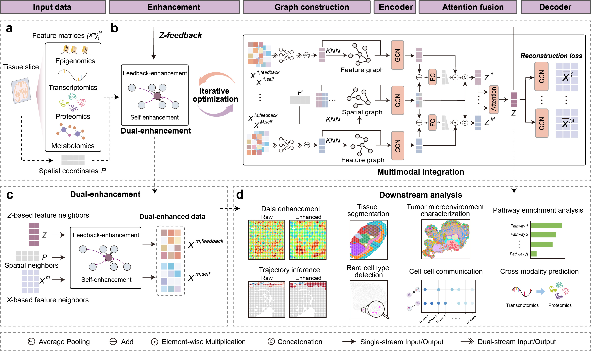

Welcome to DePass's documentation!
==================================

DePass is a dual-enhanced graph learning framework designed for integrated analysis of both single-cell and spatial paired multi-omics data. 

It flexibly supports diverse modality combinations.

----

.. toctree::
   :maxdepth: 2
   :caption: Getting Started

   install
   tutorials
   api

----

Data
----

The data used in this study are available at 
`Data <https://drive.google.com/drive/u/1/folders/1R_MhU9S1wCXDawPQm2Mxb98jz3KZPo9S>`_.
