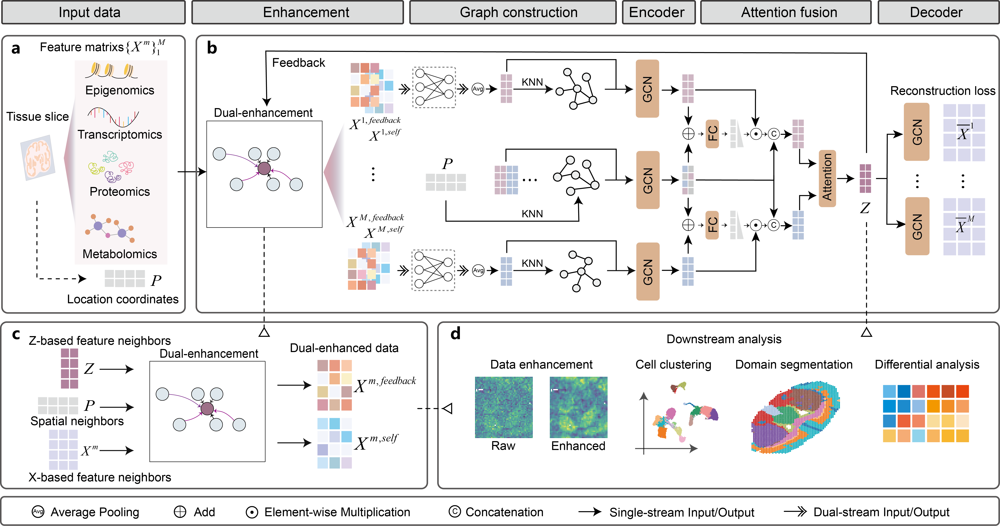

# DePass: A Dual-Enhanced Graph Learning Framework for Paired Data Integration in Single-Cell and Spatial Multi-Omics

DePass is a dual-enhanced graph learning framework for paired data integration in both single-cell and spatial multi-omics. It is capable of flexibly processing diverse modality combinations. Unlike existing methods, DePass uniquely incorporates data augmentation in model training. This data enhancement strategy leverages neighborhood information aggregation: each cell's expression value is refined using its spatial adjacent neighbors and feature-similar neighbors. Crucially, a feedback mechanism further refines neighbor selection by using integrated cross-modal representations to improve the accuracy of feature similarity estimation. This feedback-driven enhancement achieves iterative optimization of data refinement and integration during model training, gradually reducing noise while enhancing the quality of multi-omics integration. In addition, DePass incorporates a subgraph-based learning strategy to achieve scalability across large-scale datasets. The comprehensive benchmarking across six modality types, eight tissue types, and ten experimental platforms confirmed DePass’s effectiveness. It consistently outperforms existing methods in clustering accuracy and biological spatial domain identification, highlighting its versatility and establishing it as a tool for robust multi-omics integration.





## Tutorials

For detailed tutorials, you can refer to the following resources:

- **GitHub Repository**: [DePass Tutorials on GitHub](https://github.com/zhanglabNKU/DePass/tree/main/Tutorials)  

- **Read the Docs**: [DePass Documentation](https://depass-tutorials.readthedocs.io/en/latest/)  


## DePass Installation

It is preferred to create a new environment for DePass.

```bash
# Create and activate a new conda environment
conda create -n DePass python==3.8.20
conda activate DePass
```

DePass is available on PyPI, and could be installed using:

```bash
pip install DePass
```

Installation via Github is also provided:

```bash
git clone https://github.com/zhanglabNKU/DePass.git
cd DePass
pip install depass-0.0.16-py3-none-any.whl
```

Additionally, because DePass leverages mclust for clustering, installing R, the rpy2 Python interface, and the mclust R package is recommended.
```bash
conda install -c conda-forge r-base rpy2 
conda install conda-forge::r-mclust
```

Install pytorch, pytorch geometric

```bash
pip install torch==2.4.1
pip install torch-geometric==2.3.1
pip install torch_scatter torch_sparse torch_cluster torch_spline_conv -f https://data.pyg.org/whl/torch-2.4.0+cu121.html
```

---

## Requirements

```text
anndata==0.11.4
hnswlib==0.8.0
matplotlib==3.7.1
numpy==1.23.5
pandas==1.5.3
scanpy==1.11.3
scikit_learn==1.3.0
scipy==1.16.0
seaborn==0.13.2
setuptools==75.3.2
tqdm==4.65.0
torch==2.4.1
torch_geometric==2.3.1
torch_scatter==2.1.2+pt24cu121
torch-sparse==0.6.18+pt24cu121
torch-cluster==1.6.3+pt24cu121
torch-spline-conv==1.2.2+pt24cu121
R==4.3.1
rpy2==3.5.11
jupyter
mclust
```

---

## Data

The raw data used in this study is freely available at [Data](https://drive.google.com/drive/folders/1NfBDU-1E2T7CerViyK2TvbnWfsta6Q3r?usp=drive_link).
